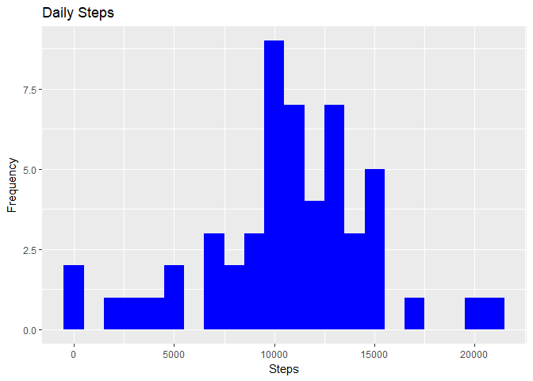
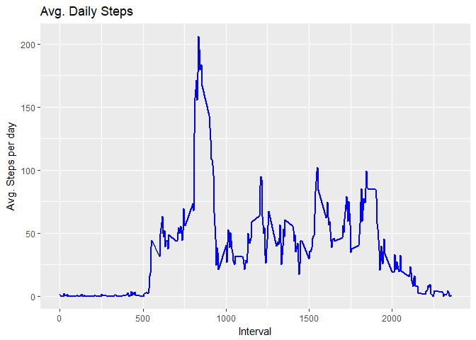
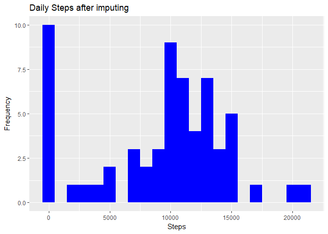
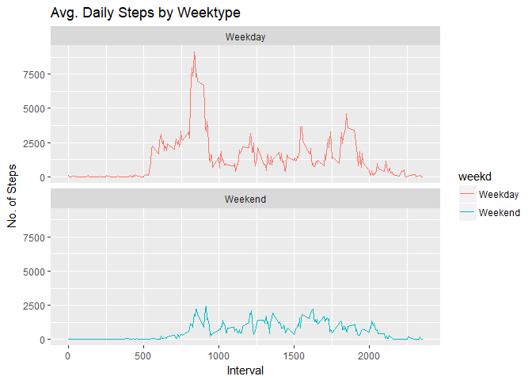

## Loading and preprocessing the data

```r
library("data.table")
library(ggplot2)
library(Hmisc)
```

```
## Loading required package: lattice
```

```
## Loading required package: survival
```

```
## Loading required package: Formula
```

```
## 
## Attaching package: 'Hmisc'
```

```
## The following objects are masked from 'package:base':
## 
##     format.pval, units
```

```r
DT <- data.table::fread(input = "activity.csv")
DT$date <- as.POSIXct(as.Date(DT$date,"%Y-%m-%d"))
```

## What is mean total number of steps taken per day?

```r
Total_Steps <- DT[, c(lapply(.SD, sum, na.rm = FALSE)), .SDcols = c("steps"), by = .(date)] 

head(Total_Steps, 10)
```

```
##                    date steps
##  1: 2012-10-01 08:00:00    NA
##  2: 2012-10-02 08:00:00   126
##  3: 2012-10-03 08:00:00 11352
##  4: 2012-10-04 08:00:00 12116
##  5: 2012-10-05 08:00:00 13294
##  6: 2012-10-06 08:00:00 15420
##  7: 2012-10-07 08:00:00 11015
##  8: 2012-10-08 08:00:00    NA
##  9: 2012-10-09 08:00:00 12811
## 10: 2012-10-10 08:00:00  9900
```

```r
ggplot(Total_Steps, aes(x = steps)) +
    geom_histogram(fill = "blue", binwidth = 1000) +
    labs(title = "Daily Steps", x = "Steps", y = "Frequency")
```

```
## Warning: Removed 8 rows containing non-finite values (stat_bin).
```

<!-- -->

## Mean and median number of steps taken each day

```r
TotMeanMed <- Total_Steps[, .(Mean_Steps = mean(steps, na.rm = TRUE), Median_Steps = median(steps, na.rm = TRUE)),by=.(date)]
head(TotMeanMed)
```

```
##                   date Mean_Steps Median_Steps
## 1: 2012-10-01 08:00:00        NaN           NA
## 2: 2012-10-02 08:00:00        126          126
## 3: 2012-10-03 08:00:00      11352        11352
## 4: 2012-10-04 08:00:00      12116        12116
## 5: 2012-10-05 08:00:00      13294        13294
## 6: 2012-10-06 08:00:00      15420        15420
```

## What is the average daily activity pattern?

```r
IntervalDT <- DT[, c(lapply(.SD, mean, na.rm = TRUE)), .SDcols = c("steps"), by = .(interval)] 

ggplot(IntervalDT, aes(x = interval , y = steps)) + geom_line(color="blue", size=1) + labs(title = "Avg. Daily Steps", x = "Interval", y = "Avg. Steps per day")
```

<!-- -->

## The 5-minute interval that, on average, contains the maximum number of steps

```r
IntervalDT[steps == max(steps), .(max_interval = interval)]
```

```
##    max_interval
## 1:          835
```

## Imputing missing values

```r
#Imputing the missing values with median value

DT$steps <- with(DT, impute(DT$steps, median))
head(DT)
```

```
##    steps                date interval
## 1:     0 2012-10-01 08:00:00        0
## 2:     0 2012-10-01 08:00:00        5
## 3:     0 2012-10-01 08:00:00       10
## 4:     0 2012-10-01 08:00:00       15
## 5:     0 2012-10-01 08:00:00       20
## 6:     0 2012-10-01 08:00:00       25
```
## Histogram of the total number of steps taken each day after missing values are imputed

```r
Total_Steps <- DT[, c(lapply(.SD, sum, na.rm = FALSE)), .SDcols = c("steps"), by = .(date)] 
ggplot(Total_Steps, aes(x = steps)) +
    geom_histogram(fill = "blue", binwidth = 1000) +
    labs(title = "Daily Steps after imputing", x = "Steps", y = "Frequency")
```

```
## Don't know how to automatically pick scale for object of type impute. Defaulting to continuous.
```

<!-- -->

## Are there differences in activity patterns between weekdays and weekends?

```r
library(chron)
DT$weekd <- is.weekend(DT$date)
DT$weekd[DT$weekd == TRUE] <- "Weekend"
DT$weekd[DT$weekd == FALSE] <- "Weekday"
DT$weekd <- as.factor(DT$weekd)

DTbyint <- DT[, c(lapply(.SD, sum)), .SDcols = c("steps"),  by = .(interval,weekd)]

ggplot(DTbyint , aes(x = interval , y = steps, color=weekd)) + geom_line() + labs(title = "Avg. Daily Steps by Weektype", x = "Interval", y = "No. of Steps") + facet_wrap(~weekd , ncol = 1, nrow=2)
```

```
## Don't know how to automatically pick scale for object of type impute. Defaulting to continuous.
```

<!-- -->

